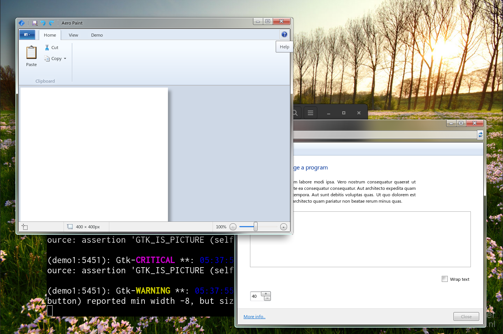

## A sleek and exciting UI in Gtk



Along with its newly integrated scene graph and hardware accelleration, Gtk4 is actually quite a powerful toolkit and I think it's put to waste on the flat UI themes that are popular today. This library tries to be a 1-to-1 re-creation the Windows Aero UI style and provides an environment to play around with the various exciting UI concepts that were around at the time.

**A pre-compiled demo can be found in _Releases_ 👉**

### Prototyping
...goes on in [this Figma document](https://www.figma.com/file/5WXM0xTlbQpyPGAOIj2LNF/Longhorn-Mockups?node-id=1201%3A171&t=ITjE0K9TWASt15T5-1). Figma can export CSS which can then be almost flawlessly applied to Gtk widgets.

The Windows 7 HIG guidelines can be found [here](https://learn.microsoft.com/en-us/windows/win32/uxguide/visual-index).

### Window blur

If you want the background of your windows to be blurry (which let's face it, you do) download the 'Blur My Shell' extension and enable window blur.
Recommended settings are:
```
sigma = 10
brightness = 0.75
opacity = 255
```

### Building

See [USAGE.md](USAGE.md)

(Image Credit: [Michiel de Boer](http://www.michieldb.nl/foto/))
