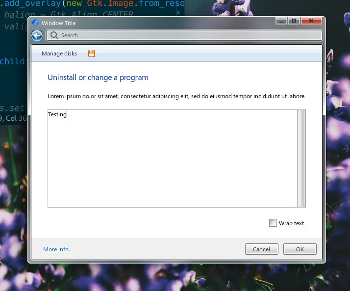

## A sleek and exciting UI in Gtk



Along with its newly integrated scene graph and hardware accelleration, Gtk4 is actually quite a powerful toolkit and I think it's put to waste on the flat UI themes that are prevalent today. This library tries to be a 1-to-1 re-creation the Windows Aero UI style and provides an environment to play around with the various exciting UI concepts that were around at the time.

### Prototyping
...goes on in [this Figma document](https://www.figma.com/file/5WXM0xTlbQpyPGAOIj2LNF/Longhorn-Mockups?node-id=1201%3A171&t=ITjE0K9TWASt15T5-1). Figma can export CSS which can then be almost flawlessly applied to Gtk widgets.

The Windows 7 HIG guidelines can be found [here](https://learn.microsoft.com/en-us/windows/win32/uxguide/visual-index).

### Window blur

Yes, this is finally possible under GNOME! Download the 'Blur My Shell' extension and enable window blur.
Recommended settings are:
```
sigma = 10
brightness = 0.75
opacity = 255
```

### Building

You need the `sassc` command installed to build the stylesheet.
